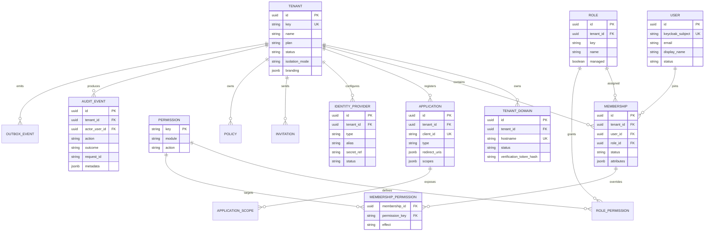

# QTS Identity Platform Architecture

## Scope

This platform is an identity control plane around Keycloak. Keycloak owns
protocols and authentication. The QTS identity backend owns tenants,
memberships, authorization, application registration, audit, and provisioning.

```mermaid
flowchart TB
  Users[Users and customer applications]
  Edge[DNS / WAF / TLS / custom domains]
  Kong[Kong Gateway\nrouting / correlation / rate limits]
  KC[Keycloak\nOIDC OAuth2 SAML LDAP MFA WebAuthn]
  IdP[Google / Microsoft / SAML / LDAP]
  API[Identity Platform Backend]
  PG[(Platform PostgreSQL)]
  KCDB[(Keycloak PostgreSQL)]
  Redis[(Redis)]
  Admin[/admin Platform Admin]
  Portal[/portal Customer Portal]
  Obs[Prometheus / Grafana]

  Users --> Edge --> Kong
  Kong --> KC
  Kong --> API
  KC --> IdP
  KC --> KCDB
  API --> PG
  API --> Redis
  Admin --> API
  Portal --> API
  KC --> Obs
  Kong --> Obs
  API --> Obs
```

Kong is the edge enforcement point for routing, correlation IDs and coarse
rate limits. The backend performs the authoritative Keycloak JWKS, issuer,
audience and MFA-claim checks so a direct internal call cannot skip identity
verification.

The local gateway exposes the BFF at `/api/identity` and the Keycloak OIDC
surface at `/realms/*` plus the static login assets. The gateway deliberately
does not proxy the Keycloak admin API; local administration remains on the
internal Keycloak port.

## Tenant model

- One Keycloak realm per environment.
- One tenant organization per customer in the platform database.
- Tenant membership, not the user record, is the authorization boundary.
- Keycloak organization/group claims are hints; the backend is the source of
  truth for membership and policy decisions.
- Shared PostgreSQL with Row-Level Security is the first deployment mode.
- Dedicated PostgreSQL is enabled per tenant through an explicit routing mode.

## Database ERD



## Security model

1. Authorization Code + PKCE S256 is the default for customer applications.
2. Access tokens are short-lived and validated by Kong and the backend.
3. Refresh token rotation is enabled in Keycloak; token families are revoked
   on replay.
4. MFA and WebAuthn are required for privileged administration and identity
   provider changes.
5. Redis is used for distributed rate limits, idempotency keys, cache entries,
   and session revocation hints. Tokens are never stored in browser storage.
6. Audit events are append-only and written with an outbox record so security
   events are not silently lost when a downstream exporter is unavailable.
7. Prometheus scrapes `/api/identity/metrics`; set `IDENTITY_METRICS_TOKEN` and
   pass it through an internal scrape header in production. The endpoint exposes
   only process and dependency health gauges, never tenant data or tokens.

## Default authorization matrix

| Role     | Baseline capabilities                     | Elevated operation                                             |
| -------- | ----------------------------------------- | -------------------------------------------------------------- |
| Admin    | All catalog permissions                   | `ROLE_MANAGE`, IdP, policy and application changes require MFA |
| Manager  | Create/read/update users and view reports | Cannot assign roles or mutate an Admin membership              |
| Employee | View reports                              | Access can be granted or denied per membership override        |

The effective decision is `role permissions -> membership override -> ABAC`;
an explicit `DENY` wins. `ROLE_MANAGE` is kept separate from ordinary
`USER_UPDATE` so a manager cannot self-promote another member.

## Threat model

| Asset                | Threat                                           | Control                                                                                           |
| -------------------- | ------------------------------------------------ | ------------------------------------------------------------------------------------------------- |
| Tenant data          | Cross-tenant query or confused-deputy access     | Verified tenant context, parameterized queries and PostgreSQL RLS                                 |
| Tokens and secrets   | Browser theft, logs or database disclosure       | Opaque encrypted Redis sessions, PKCE, rotation, secret-manager references and metadata redaction |
| Admin actions        | CSRF, privilege escalation or last-admin lockout | Same-origin mutation checks, MFA step-up, `ROLE_MANAGE` and last-active-admin invariant           |
| Federation endpoints | SSRF, insecure redirect or forged IdP config     | HTTPS/LDAPS-only schemas, exact redirect matching and outbox-based provisioning boundary          |
| Availability         | Login/API floods or dependency outage            | Redis rate limits, Kong limits, bounded request bodies, health/metrics and short DB timeouts      |

## Isolation and migration

All tenant-scoped tables have a non-null `tenant_id`. Each request resolves a
verified tenant context, starts a database transaction, and sets
`SET LOCAL app.tenant_id`. PostgreSQL RLS is defense in depth behind backend
membership checks. Platform-wide operations use a separate privileged role and
must provide an audit reason.

Shared to dedicated migration:

```text
provision -> backfill -> checksum -> dual-write -> shadow-read -> freeze
-> final-sync -> switch-routing -> observe -> rollback-window
```

## API conventions

- The current Next.js BFF is exposed under `/api/identity`; the Kong contract
  can publish the same resources behind a versioned `/v1` prefix without
  changing service code.
- List endpoints always support pagination and stable ordering.
- High-risk mutations carry request IDs into audit/outbox records; an
  idempotency-key middleware is reserved for the external gateway contract.
- Errors use `{ error: { code, message, details? } }` consistently.
- The backend validates external input at route boundaries with Zod.

## Implementation slices

1. Infrastructure and PostgreSQL control-plane schema.
2. Keycloak issuer/JWKS/token validation and tenant context.
3. Tenant and domain service.
4. Membership, invitations, activation, and suspension.
5. RBAC plus membership-scoped overrides and ABAC policy evaluation.
6. Application registration and client lifecycle.
7. Audit/outbox and security event export.
8. `/admin` console and `/portal` integration.
9. Federation, MFA/WebAuthn, SCIM, white-label login, and dedicated storage.

## Local infrastructure

Copy `.env.identity.example` to `.env.identity`, replace every placeholder
password, then run:

```powershell
npm run identity:compose:config
npm run identity:compose:up
$env:IDENTITY_DATABASE_URL = 'postgresql://...'
$env:REDIS_URL = 'redis://...'
npm run identity:smoke
```

The application connects with `PLATFORM_APP_DB_USER`, which is explicitly
created with `NOBYPASSRLS`. `PLATFORM_DB_USER` owns migrations and must never be
used by the application runtime.
